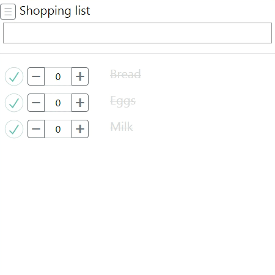

## Shopping list

This is a shopping list application. It is built in Python (Flask) and JavaScript (Vue). You can run it on your server and access it from your browser. It supports setting the quantity for each item and adding/removing multiple items through custom lists. The Python backend logs every action (together with the coordinates of your device) in an SQLite database.

### Instructions

Run it on your server:
```
FLASK_APP=shopping_list.py nohup flask run &
```

### Demonstration


